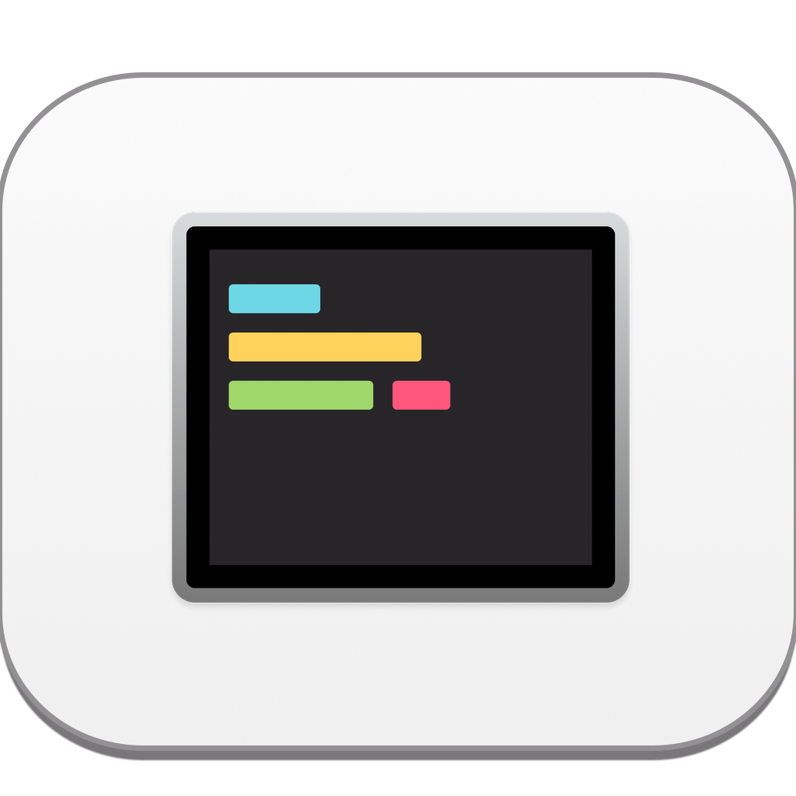
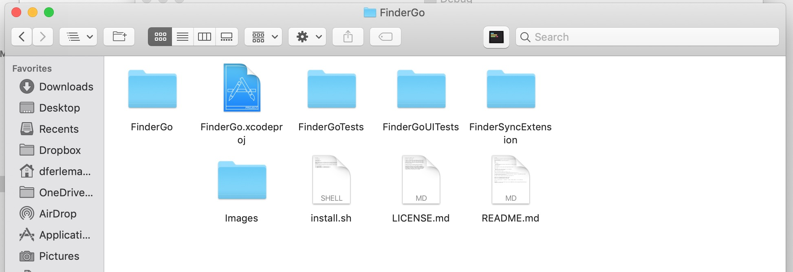

# GoFinder

<div align = "center">

<br>
<br>
</div>

<div align = "center">

<br>
<br>
</div>

## Description

- A macOS app and Finder Sync Extension to open Terminal, iTerm, Hyper from Finder

## How to install

- Get the binary from https://github.com/dferlemann/FinderGo/releases

## How to use

- Right click on app to open, because this is not from AppStore
- Cmd+Drag app icon into Finder toolbar

## How to change default terminal

First, run the install.sh script in the terminal, or run:
```sh
curl -fsSL https://raw.githubusercontent.com/onmyway133/FinderGo/master/install.sh | sh
```
(The install.sh script copy scripts from `FinderSyncExtension/Scripts` in project to `/Library/Application Scripts/com.onmyway133.FinderGo.FinderSyncExtension` )

Run either of these to change your default terminal that FinderGo uses

```
defaults write com.onmyway133.FinderGo terminal Terminal
defaults write com.onmyway133.FinderGo terminal iTerm
defaults write com.onmyway133.FinderGo terminal Hyper
```

Check for `System Preferences` -> `Extensions` -> `Finder` to enable `FinderGo` if it is not enabled yet

## Credits
Base on [Khoa Pham, onmyway133's work](https://github.com/onmyway133/FinderGo).  

The background image is using [entisocial's PSD](https://entisocial.wordpress.com/2016/03/28/custom-droplet-for-el-capitans-finders-toolbar/) and converted to Pixelmater file in the images folder.

I used [AppIconMaker](https://appiconmaker.co/Home/Index/e1afc008-7fbf-473d-9391-1a4c09221451) for generating different sizes of PNG icons.  

## License

**FinderGo** is available under the MIT license. See the [LICENSE](https://github.com/onmyway133/FinderGo/blob/master/LICENSE.md) file for more info.
